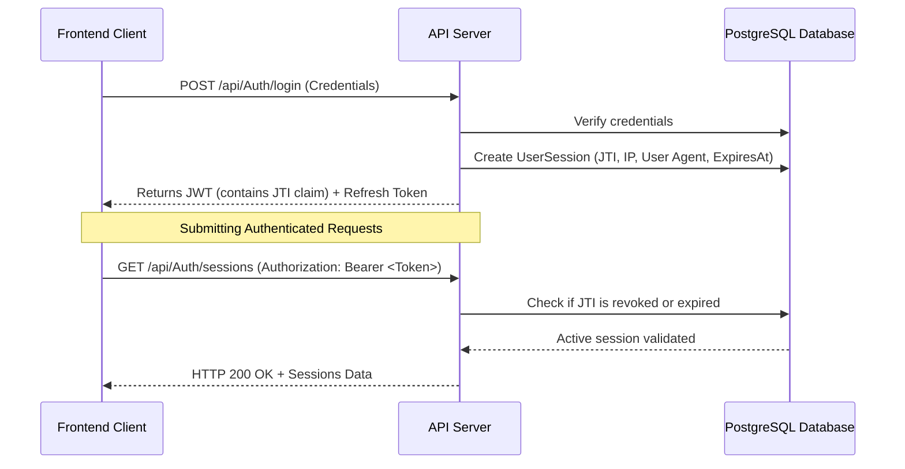

# FUTA Medical Booking System - Frontend Integration & API Guide

This guide is designed for the Frontend Developer to understand the architecture, authentication, session management, onboarding workflows, and API endpoints of the FUTA Medical Booking System.

---

## 1. System Architecture & Authentication Flow

The backend is built on **Clean Architecture** with .NET 10 and PostgreSQL. Security is managed via **JWT (JSON Web Tokens)** with a real-time **Session Tracking & Revocation** layer.



### JWT Token Design & Expiry
* **Access Token**: Expires in **24 hours** (1440 minutes). Contains the custom `jti` (JWT ID) claim, user ID, email, and roles.
* **Refresh Token**: Expires in **7 days**. Used to fetch a new access token when the current one expires.

### Real-Time Token Blacklisting (Immediate Logout)
The backend implements **on-the-fly JWT validation**. On every API call decorated with `[Authorize]`, the server interceptor inspects the token's `jti` and queries the active session index:
1. If the session has been flagged as **revoked** (via a logout call), the request is rejected immediately with a **401 Unauthorized** status code.
2. **Multi-Tab / Multi-Device Logout**: If a user has the app open in multiple tabs or devices and clicks "Logout" in one, the token's JTI is blacklisted instantly. When any other tab attempts an API request with that token, it will receive a `401 Unauthorized` and should immediately boot the user to the login screen.

---

## 2. Session Management & Control Endpoints

Users can view and manage their active login sessions. This allows them to see where they are currently logged in and selectively "log out" other devices or browser sessions.

### A. List Active Sessions
* **Endpoint**: `GET /api/Auth/sessions`
* **Headers**: `Authorization: Bearer <token>`
* **Response (200 OK)**:
```json
{
  "success": true,
  "message": "Active sessions retrieved successfully",
  "data": [
    {
      "tokenJti": "98a10d4e-698b-4bed-883e-b837773b36cd",
      "userAgent": "Mozilla/5.0 (Windows NT 10.0; Win64; x64) Chrome/120.0.0.0",
      "ipAddress": "192.168.1.15",
      "createdAt": "2026-06-03T04:30:00Z",
      "expiresAt": "2026-06-04T04:30:00Z",
      "isCurrentSession": true
    },
    {
      "tokenJti": "0dd353c3-dc6d-42ea-ba2b-8a3e4d501c84",
      "userAgent": "Mozilla/5.0 (iPhone; CPU iPhone OS 17_2 like Mac OS X) Safari/605.1.15",
      "ipAddress": "102.93.11.247",
      "createdAt": "2026-06-03T01:15:00Z",
      "expiresAt": "2026-06-04T01:15:00Z",
      "isCurrentSession": false
    }
  ],
  "errors": null,
  "statusCode": 200
}
```

### B. Logout Current Session
* **Endpoint**: `POST /api/Auth/logout`
* **Headers**: `Authorization: Bearer <token>`
* **Description**: Instantly revokes the active token in use.
* **Response (200 OK)**:
```json
{
  "success": true,
  "message": "Logged out successfully",
  "data": {},
  "statusCode": 200,
  "errors": null
}
```

### C. Revoke Specific Session (Device Logout)
* **Endpoint**: `POST /api/Auth/logout/{jti}`
* **Headers**: `Authorization: Bearer <token>`
* **Description**: Revokes a specific session using its `tokenJti` key. If that session is open on another device or tab, it will be instantly logged out on its next request.
* **Response (200 OK)**:
```json
{
  "success": true,
  "message": "Session '0dd353c3-dc6d-42ea-ba2b-8a3e4d501c84' has been revoked successfully",
  "data": {},
  "statusCode": 200,
  "errors": null
}
```

### D. Logout All Sessions
* **Endpoint**: `POST /api/Auth/logout/all`
* **Headers**: `Authorization: Bearer <token>`
* **Description**: Revokes **every** active session for the authenticated user (including the current session).
* **Response (200 OK)**:
```json
{
  "success": true,
  "message": "Logged out of all sessions successfully",
  "data": {},
  "statusCode": 200,
  "errors": null
}
```

---

## 3. Doctor Invitation & Onboarding Workflow

The Doctor lifecycle involves a secure, multi-step onboarding process coordinated via an asynchronous email engine.

```mermaid
graph TD
    A[Admin creates Doctor profile] -->|POST /api/Admin/doctors| B(Backend generates Setup Token)
    B -->|Async Event| C[Background Queue Processor]
    C -->|Resend Email API| D[Doctor receives Email with Setup Link]
    D -->|Click Link| E[Frontend page: Set Password]
    E -->|POST /api/Auth/set-password| F[Password Created]
    F -->|Log In| G[Frontend page: Complete Onboarding Profile]
    G -->|POST /api/Doctors/complete-onboarding| H[Application Pending Review]
    H -->|Admin Panel| I[Admin reviews and approves/rejects]
    I -->|POST /api/Admin/doctors/{id}/review| J[Doctor Verified & Active]
```

### Step 1: Admin Invites Doctor
An Admin creates the basic account using only the email and phone number.
* **Endpoint**: `POST /api/Admin/doctors`
* **Headers**: `Authorization: Bearer <admin_token>`
* **Request Body**:
```json
{
  "email": "doctor.smith@futa.edu.ng",
  "phoneNumber": "+2348034567890"
}
```
* **Response (201 Created)**:
```json
{
  "success": true,
  "message": "Doctor invitation sent successfully",
  "data": {
    "doctorId": "046f36ee-4b9f-4cae-a5d8-13ab727971e6",
    "setupToken": "txxyP6E2chxktXpuE2eMVkFA3NdlgputWnnrd5J_Wvg"
  },
  "statusCode": 201,
  "errors": null
}
```

### Step 2: Email Templates & Async Dispatching
When the doctor is invited, the backend triggers an asynchronous `UserInvitedEvent` which:
1. Fetches the `DOCTOR_INVITATION` HTML template from the database.
2. Compiles template tokens (replacing `{{setupLink}}` with the URL: `https://<frontend-url>/set-password?token=txxyP6E2chxktXpuE2eMVkFA3NdlgputWnnrd5J_Wvg&email=doctor.smith@futa.edu.ng`).
3. Appends the message to the `EmailQueue` database table.
4. The background `EmailQueueProcessor` service polls the queue, sends the email via the Resend API with exponential retry backoff, and updates the status to `Completed`.

### Step 3: Doctor Sets Password
The doctor clicks the link in their email and is directed to the frontend path `/set-password`.
* **Endpoint**: `POST /api/Auth/set-password`
* **Request Body**:
```json
{
  "email": "doctor.smith@futa.edu.ng",
  "token": "txxyP6E2chxktXpuE2eMVkFA3NdlgputWnnrd5J_Wvg",
  "password": "SecureDoctorPass123!",
  "confirmPassword": "SecureDoctorPass123!"
}
```
* **Response (200 OK)**:
```json
{
  "success": true,
  "message": "Password set successfully. You can now log in.",
  "data": {},
  "statusCode": 200,
  "errors": null
}
```

### Step 4: Doctor Completes Onboarding Profile
After setting their password, the Doctor logs in and submits their full qualifications, documents, and department information.
* **Endpoint**: `POST /api/Doctors/complete-onboarding`
* **Headers**: `Authorization: Bearer <doctor_token>`
* **Request Body**:
```json
{
  "firstName": "James",
  "lastName": "Smith",
  "departmentId": "aa0e8400-e29b-41d4-a716-446655440008",
  "specialization": "Cardiovascular Medicine",
  "licenseNumber": "MDN/2026/98765",
  "yearsOfExperience": 8,
  "bio": "Experienced cardiologist specializing in clinical diagnostics and cardiovascular wellness.",
  "qualifications": "MBBS (Unilag), FWACP (Cardiology)",
  "identificationDocument": "https://storage.futa.edu.ng/docs/id_smith.pdf",
  "certificateDocument": "https://storage.futa.edu.ng/docs/cert_smith.pdf"
}
```
* **Response (200 OK)**:
```json
{
  "success": true,
  "message": "Onboarding profile submitted successfully. Awaiting admin review.",
  "data": {},
  "statusCode": 200,
  "errors": null
}
```

### Step 5: Admin Reviews & Approves Application
Admins can fetch pending applications, view files, and approve/reject them.
* **Endpoint**: `POST /api/Admin/doctors/{doctorId}/review`
* **Headers**: `Authorization: Bearer <admin_token>`
* **Request Body**:
```json
{
  "status": "Approved", // "Approved" or "Rejected"
  "rejectionReason": "" // Optional if rejected
}
```
* **Response (200 OK)**:
```json
{
  "success": true,
  "message": "Doctor application status updated to Approved",
  "data": {},
  "statusCode": 200,
  "errors": null
}
```

---

## 4. Key Endpoint Registry (REST API)

### Authentication
* `POST /api/Auth/register-student` - Student registration.
* `POST /api/Auth/login` - User login. Sets the `UserSession` record tracking IP and UA.
* `POST /api/Auth/refresh-token` - Exchanges an expired JWT for a new one.

### Student Profile
* `GET /api/Students/profile` - Fetches profile details.
* `PATCH /api/Students/profile` - Modifies profile fields.
  * **Immutable Fields** (cannot be modified after registration): `firstName`, `lastName`, `matricNumber`, `dateOfBirth`, `gender`.
  * **Mutable Fields**: `phoneNumber`, `address`, `faculty`, `department`, `yearOfStudy`, `bloodGroup`, `genotype`, `allergies`, `emergencyContacts`.

### Departments
* `GET /api/Departments` - Lists all medical departments (Cardiology, Dermatology, Orthopedics, etc.).

### Appointments
* `POST /api/Appointments` - Creates a new appointment (Student only). Requires: `doctorId`, `departmentId`, `appointmentDate`, `reasonForVisit`, `symptoms`, and standard `vitalSigns` object:
  ```json
  "vitalSigns": {
    "temperature": 37.1,
    "bloodPressure": "120/80",
    "heartRate": 80,
    "respiratoryRate": 18,
    "weight": 70,
    "height": 178
  }
  ```
* `GET /api/Appointments/student` - Fetches appointment history (Student only).
* `GET /api/Appointments/doctor` - Fetches assigned appointments (Doctor only).
* `PUT /api/Appointments/{id}/status` - Sets appointment status (`Confirmed`, `Completed`, `Cancelled`) (Doctor/Admin).

### Prescriptions & Emergencies
* `GET /api/Prescriptions` - Retrieves user prescriptions.
* `POST /api/Emergencies` - Creates a priority emergency request.
* `GET /api/Emergencies` - Lists active emergency signals (Admin/Staff only).
* `POST /api/Emergencies/{id}/resolve` - Marks emergency as resolved.

---

## 5. Frontend Development Best Practices

### 1. HTTP Interceptor for JWT Authorization
Attach the JWT token dynamically to all outgoing requests.
```typescript
axios.interceptors.request.use((config) => {
  const token = localStorage.getItem('accessToken');
  if (token) {
    config.headers.Authorization = `Bearer ${token}`;
  }
  return config;
});
```

### 2. Handling Token Expiration & Silently Refreshing
Listen to `401 Unauthorized` responses. If the error is due to an expired token, request a refresh:
```typescript
axios.interceptors.response.use(
  (response) => response,
  async (error) => {
    const originalRequest = error.config;
    if (error.response?.status === 401 && !originalRequest._retry) {
      originalRequest._retry = true;
      try {
        const refreshToken = localStorage.getItem('refreshToken');
        const res = await axios.post('/api/Auth/refresh-token', { refreshToken });
        if (res.data.success) {
          localStorage.setItem('accessToken', res.data.data.token);
          localStorage.setItem('refreshToken', res.data.data.refreshToken);
          originalRequest.headers.Authorization = `Bearer ${res.data.data.token}`;
          return axios(originalRequest);
        }
      } catch (refreshError) {
        // Refresh token is also expired or invalid - force user to log in again
        clearUserSessionAndRedirect();
      }
    }
    return Promise.reject(error);
  }
);
```

### 3. Graceful Logout Action
When a user clicks Logout, always invoke the API endpoint `/api/Auth/logout` to blacklist the token on the server before clearing the local storage and state. This ensures the token cannot be reused even if intercepted.

### 4. Interactive Session List UI
Provide a screen in the user settings panel that lists all active sessions (obtained from `/api/Auth/sessions`). Let the user see device names (parsed from the `userAgent` string) and IP addresses, along with a "Revoke" button to log out of other devices.

---

## 6. Staging & Environment Credentials

* **Staging Base URL**: `https://cryptic-dusk-98774-c778357967fc.herokuapp.com`
* **Staging Swagger UI**: `https://cryptic-dusk-98774-c778357967fc.herokuapp.com/swagger`

### Seed Accounts for Verification
| Role | Email | Password |
|---|---|---|
| **Admin** | `francisgbohunmi@gmail.com` | `Admin123!` |
| **Doctor** | `doctor@futa.edu.ng` | `Doctor123!` |
| **Student** | `student@futa.edu.ng` | `Student123!` |
